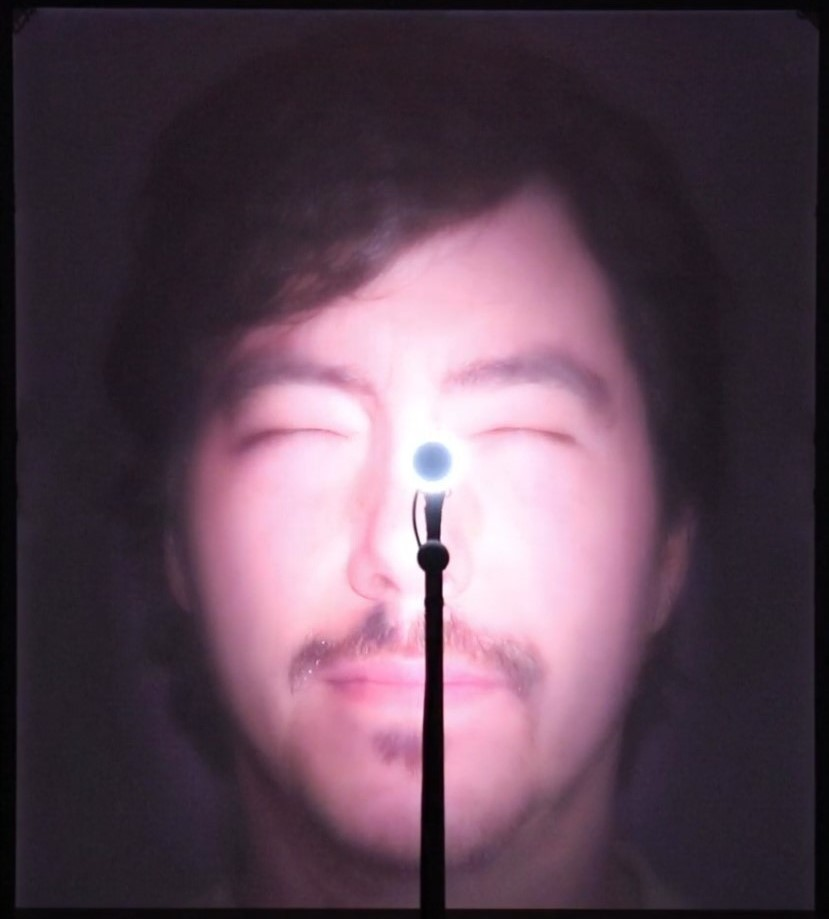

# Morphogenèse

Code source d'une installation audiovisuelle qui met en relation le spectateur avec des modèles profonds génératifs et le place face à des représentations artificielles de sa voix et de son visage.

